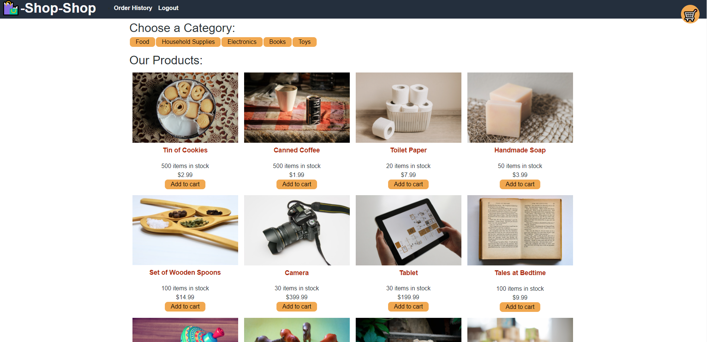

# shop-shop

  ## Description
  
  A full stack shopping website. Uses placeholder products and prices. Utilizes the redux context api to keep track of global
  state.

  ## Table of Contents

  * [Installation](#installation)
  * [Usage](#usage)
  * [Credits](#credits)
  * [License](#license)
  * [Contribution](#contributing)

  ## Installation
        
  Download initial files, install all required packages with the npm install command from the root directory to get files.
  Run npm start from top level menu to get access to the running application.
  
  ## Usage
  
  

  ## Credits
    
  Contributor: Brent M Johnson
  GitHub: https://github.com/uberbrent
      
  ## License
  MIT
   
  [See MIT License](https://choosealicense.com/licenses/mit)

  ## Features
    
  An example storefront, utilizing Stripe as a checkout extension and GraphQL for the back-end database.

  ## Contributing
  
  Please follow the standard Contributor Covenant when looking to make any additions to this project. The Standard Contributor Covenant can be found at [https://www.contributor-covenant.org/](https://www.contributor-covenant.org/)
    
